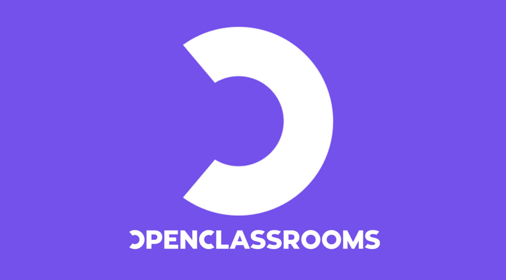

# Projets Openclassrooms

Ce dépôt contient les projets réalisés durant la formation Data Analyst d'Openclassrooms.

## Projet 3 - Réalisez une étude de santé publique
### Objectifs
* A partir des données de la FAO en 2013, analyser les principaux tendances sur la sous-nutrition via les libraries Python (Pandas)
* Construire une base de données SQL avec les données FAO

### Compétences acquises
* Effectuer des requêtes complexes en SQL
* Maîtriser les bases de R ou Python
* Utiliser une documentation technique
* Récupérer des données à partir d'une source identifiée 
* Utiliser les librairies spécialisées pour la Data Science 
* Appliquer l'algèbre relationnelle en R ou Python

## Projet 4 - Analysez les ventes de votre entreprise
### Objectifs
* Nettoyer les données de l'entreprise avec Pandas
* Développer des analyses exploratoires et descriptives avec Pandas + Numpy
* Développer des graphiques avec Matplotlib + Scikit learn
  
### Compétences acquises
* Nettoyer un jeu de données
* Décrire un jeu de données par la statistique descriptive 
* Maîtriser les concepts statistiques fondamentaux

## Projet 5 - Produisez une étude de marché
### Objectifs
* A partir des données du projet 3, caractériser les pays via la classification CAH avec R
* Constuire un dendogram basé sur cette classification
* Tester l'adéquation de la classification via des tests d'adéquation et de comparaisons
  
### Compétences cibles
* Construire et lire un dendogramme
* Interpréter une ACP
* Tester l’adéquation à une loi par un test statistique

## Projet 6 - Détectez des faux billets
### Objectifs

### Compétences cibles
* Interpréter une ACP
* Modéliser grâce à la régression logistique
* Réaliser une ACP
* Utiliser un algorithme de clustering de type Kmeans

## Projet 7 - Effectuez une prédiction de revenus
### Objectifs

### Compétences cibles
* Maîtriser les bases de la statistique inférentielle 
* Maîtriser les bases des probabilités
* Modéliser des données

Projet 8 - Prédisez la demande en électricité
### Objectifs

### Compétences cibles
* Maitriser les méthodes de lissage et la méthode de Holt-Winters 
* Maitriser les notions de composantes et de modèles de décomposition 
* Maitriser la méthode ARMA
* Représenter graphiquement une série temporelle
